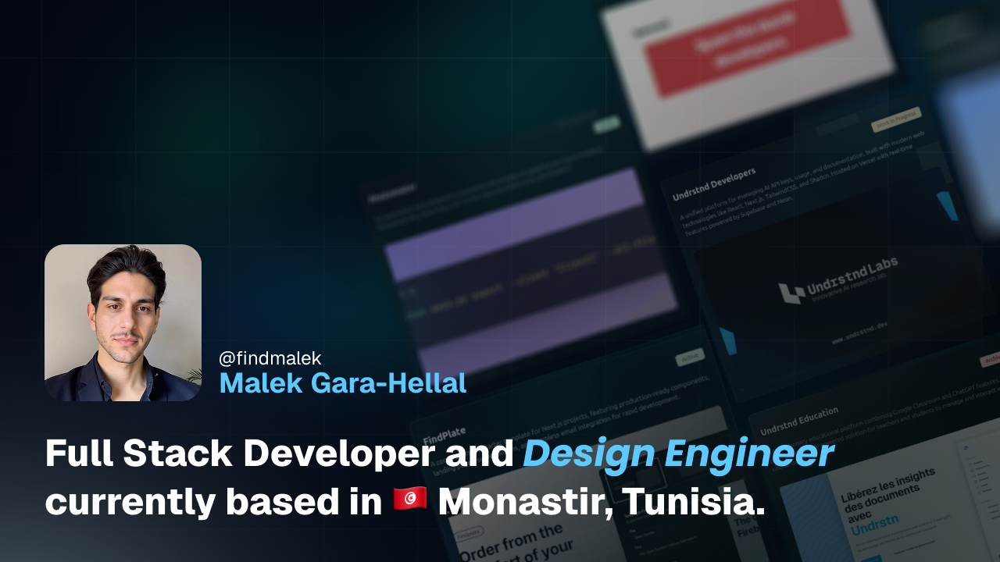

# 💫 [Malek Gara-Hellal](https://www.findmalek.com)

Specialized in transforming complex ideas into elegant digital solutions through web development, design engineering, and entrepreneurial innovation. I craft meaningful projects that blend creativity with technical precision. Explore my <a href="https://www.findmalek.com/work">WORK</a> experience, check out my <a href="https://www.findmalek.com/projects">PROJECTS</a>, discover my technical <a href="https://www.findmalek.com/stack">STACK</a>, or learn about my <a href="https://www.findmalek.com/about#overview">VENTURES</a> where innovative ideas become thriving businesses.

   

      
      
      
      
   

---

### 🧰 Languages and Tools

 

 

#

### 📊 Stats

### 🫂 Social Media Accounts

   
   
   

   
